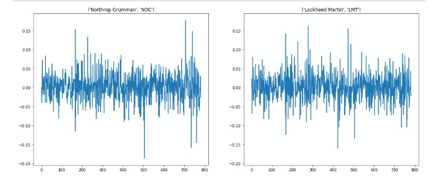

# Stock-maket-clustering-using-KMeans

Stock market movements of 28 companies from over a period of 2 years was used for this project.
## Tools used 

Pandas for reading the dataset
Scikit learn for KMeans and PCA
Matplotlib for plotting

## Normalisation 

Since the data included companies having varied stock movements it was necessary to normalise the dataset.

## PCA 

In order to plot the clusteres the 755 dimension was reduced to 2 using PCA from scikit learn package.

### White markers represent the centroid of each cluster and black dots represent each companies in each of the clusters
